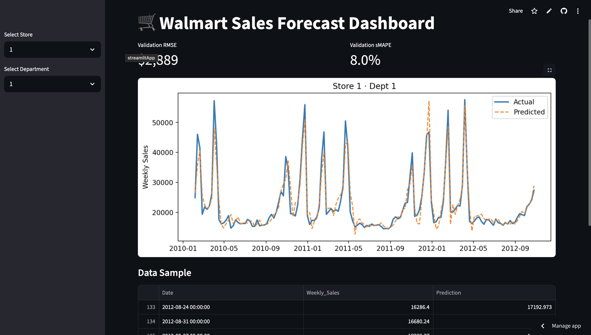
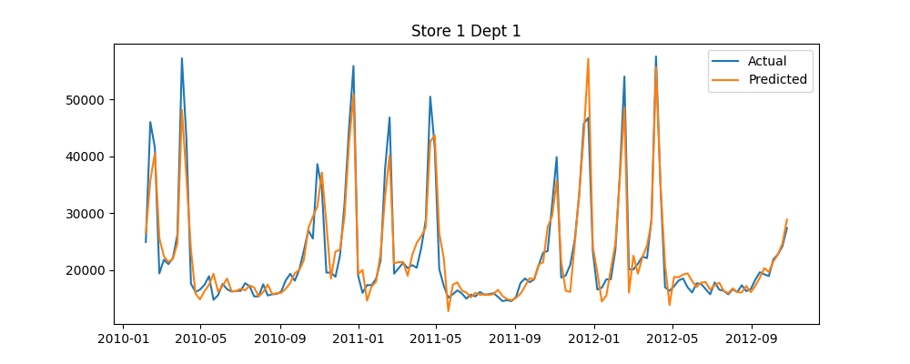

# Walmart Sales Forecasting & Inventory Optimization

[![Python 3.12][py-badge]][py] [![Streamlit][st-badge]][st] [![License: MIT][license-badge]][license] [![CI][ci-badge]][ci]

---

## 📋 Table of Contents
1. [🚀 Overview](#-overview)  
2. [📦 Data Source](#-data-source)  
3. [⚡ Quickstart](#-quickstart)  
4. [🛠️ Installation](#️-installation)  
5. [📊 Results](#-results)  
6. [🖼️ Screenshots](#️-screenshots)  
7. [☁️ Live Demo](#️-live-demo)  
8. [🔧 Tech Stack](#-tech-stack)  
9. [📈 Future Work](#-future-work)  
10. [🤝 Contributing](#-contributing)  
11. [⚖️ License](#️-license)  

---

## 🚀 Overview
A streamlined analytics pipeline that forecasts Walmart’s weekly sales and guides inventory optimization.  
**Highlights:**  
- **Data:** 2010–2012, 45 stores, 143 weeks  
- **Model:** XGBoost regressor vs. naïve last-week baseline  
- **Performance:** RMSE ≈ $3,379 (sMAPE ≈ 40.4%) vs. baseline RMSE ≈ $9,986  
- **Deployment:** Interactive Streamlit dashboard packaged in Docker  

---

## 📦 Data Source
This project uses the [Walmart Store Sales Forecasting][kaggle-link] dataset from Kaggle:  
- **train.csv** — Weekly sales by store & department  
- **features.csv** — External factors (weather, CPI, fuel price, promotions)  
- **stores.csv** — Store metadata (type, size)  

> **Attribution:** Provided by Walmart via Kaggle for educational use.

---

## ⚡ Quickstart
```bash
git clone https://github.com/youruser/walmart-sales-forecasting.git
cd walmart-sales-forecasting

# 1. Create & activate virtual environment
python -m venv venv
source venv/bin/activate

# 2. Install dependencies
pip install -r requirements.txt

# 3. Run full pipeline
python -m src.preprocess
python -m src.feature_engineering
python -m src.hyperparameter_grid
python -m src.model_eval
python -m src.forecast

# 4. Launch dashboard
streamlit run app/dashboard.py
```

---

## 🛠️ Installation
1. **Clone** the repo  
2. **Create** a Python 3.12 virtual environment & **activate**  
3. **Install** dependencies:  
   ```bash
   pip install -r requirements.txt
   ```  
4. **Add** the three Kaggle CSVs into `data/raw/`  

---

## 📊 Results

After running the full pipeline and evaluating on the hold-out set:

| Model                       | RMSE    | sMAPE   |
|-----------------------------|---------|---------|
| Naïve (last-week)           | 9,986   | 75.2 %  |
| XGBoost (baseline features) | 3,379   | 40.4 %  |
| XGBoost (enriched + tuned)  | **3,280** | **38.7 %** |

- **RMSE:** Tuned model cuts average error from $9.9 K to $3.3 K per store–department.  
- **sMAPE:** Relative error improves from ~75 % to ~39 %, ensuring consistency across volumes.

---

## 🖼️ Screenshots

### Dashboard Interface  


### Sample Forecast (Store 1, Dept 1)  


---

## ☁️ Live Demo
Try it live on Streamlit Cloud:  
👉 [Walmart Forecast Dashboard](https://walmartsalesforecasting-8qgin3zjyeghyancrfffux.streamlit.app)  
[![Streamlit][st-badge]][st]

---

## 🔧 Tech Stack
- **Data Processing:** Pandas, Python-dateutil  
- **Modeling:** XGBoost, scikit-learn  
- **Visualization & UI:** Matplotlib, Streamlit  

---

## 📈 Future Work
- **Target transform:** apply `log1p` to stabilize variance  
- **Segmented models:** separate high-volume vs low-volume departments  
- **Holiday features:** proximity flags for major holiday weeks  
- **Ensembling:** blend XGBoost with ARIMA/Prophet for trend capture  
- **API layer:** expose forecasts via FastAPI
- **Deployment:** Docker, Streamlit Community Cloud, GitHub Actions CI  
- **Testing:** pytest, coverage, black, isort  

---

## 🤝 Contributing
Contributions welcome! Please read [CONTRIBUTING.md](CONTRIBUTING.md) for guidelines on code style, testing, and pull requests.

---

## ⚖️ License
This project is licensed under the MIT License. See [LICENSE](LICENSE) for details.

---

[py-badge]: https://img.shields.io/badge/python-3.12-blue  
[py]: https://www.python.org/  
[st-badge]: https://static.streamlit.io/badges/streamlit_badge_black_white.svg  
[st]: https://walmartsalesforecasting-8qgin3zjyeghyancrfffux.streamlit.app  
[license-badge]: https://img.shields.io/badge/license-MIT-green  
[license]: LICENSE  
[ci-badge]: https://github.com/youruser/walmart-sales-forecasting/actions/workflows/ci.yml/badge.svg  
[ci]: https://github.com/youruser/walmart-sales-forecasting/actions  
[kaggle-link]: https://www.kaggle.com/competitions/walmart-recruiting-store-sales-forecasting/data  
